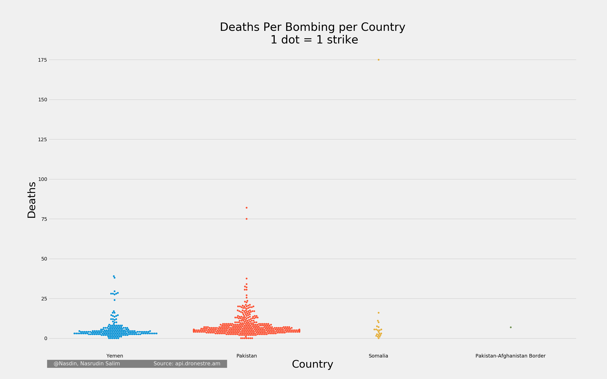
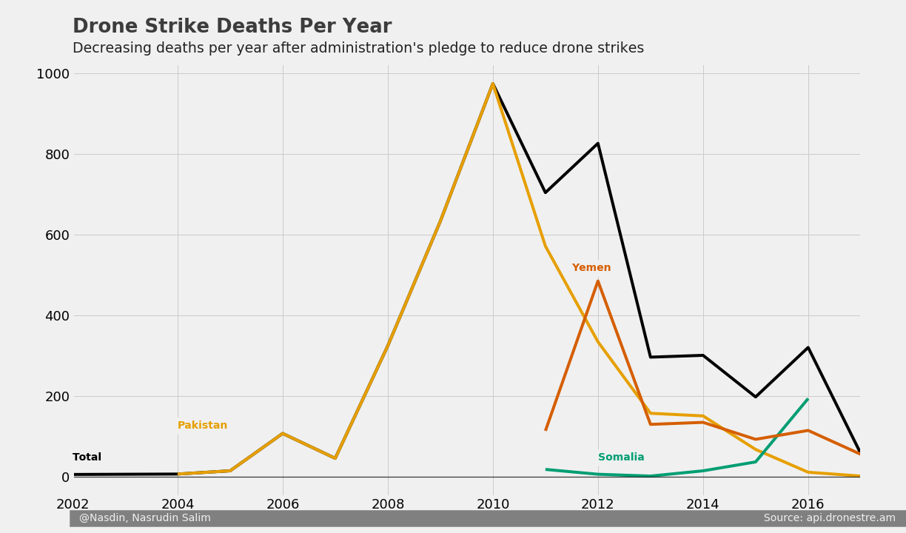
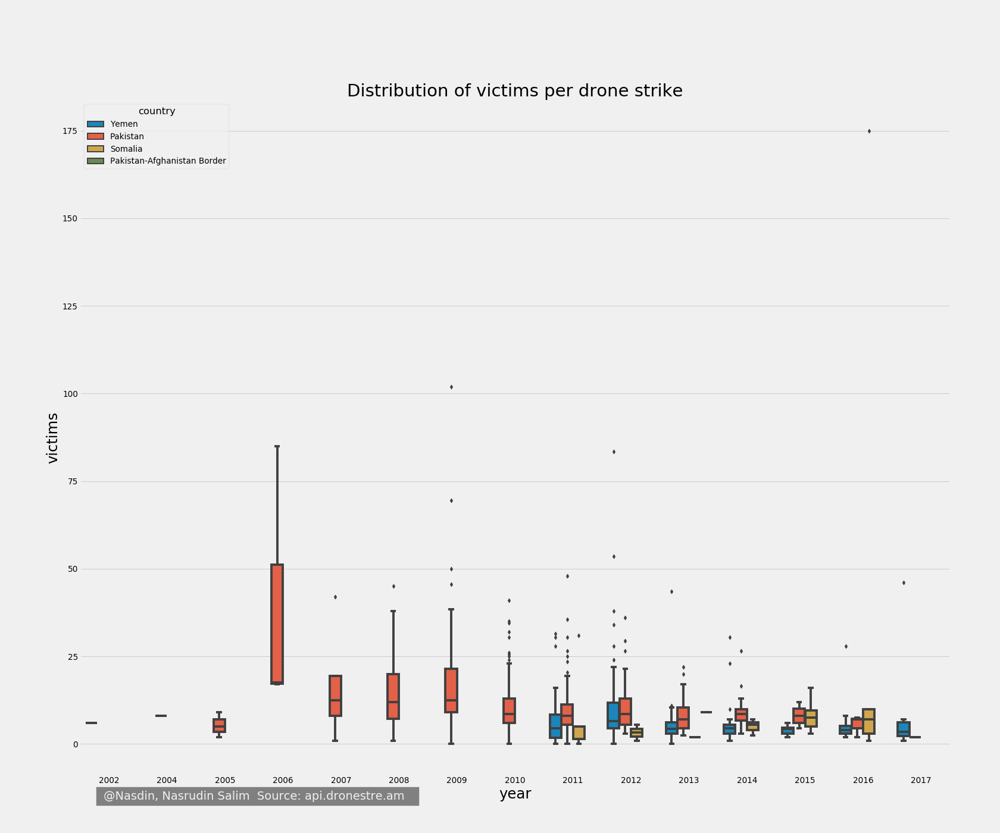
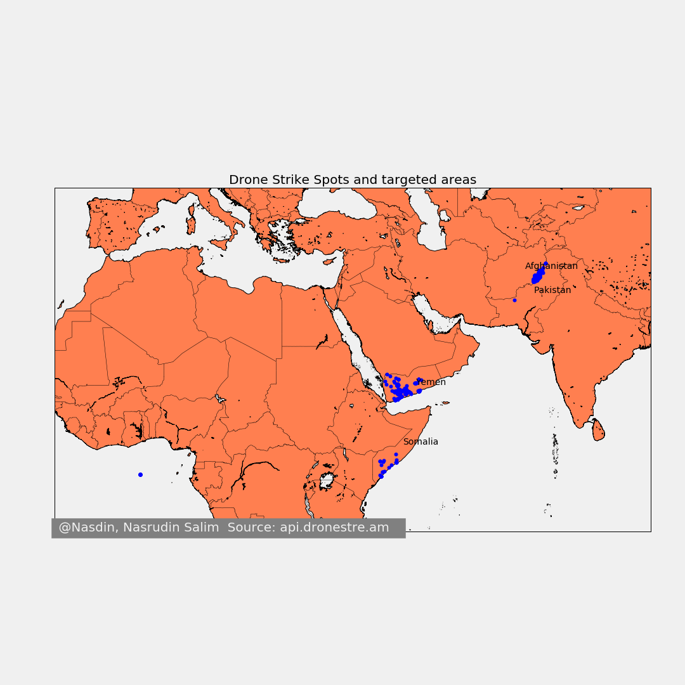

# EDA and Visualization for Drone Strikes
## As an assignment from General Assembly Data Science Immersive School
This was initially supposed to be a group project, but fell through as I ended up pushing the work singlehandedly. An assignment that was for 4 hours in class, but I redid it in December 2017 - Jan 2018, see commit histories. 

api.dronestre.am

**Your mission:** 
- Explore the drone strike data and describe it
- Do some accompanying research to augment your analysis
- Report back any good summary statistics

One of the needs for data science in organizations is to bring measure to vague problems. What can be measured in this dataset with certainty? Drive your presentation from what can be measured, reported. 

Since the API from `api.dronestre.am` provides data on drone strikes in near real time, this might be useful to hold the President accountable if he/she promises to reduce drone strikes. 

# What countries are being targeted?

# Drone strike deaths per year?

# How dangerous were the drone strikes?

# Are the bombs targetted in any particular area?
